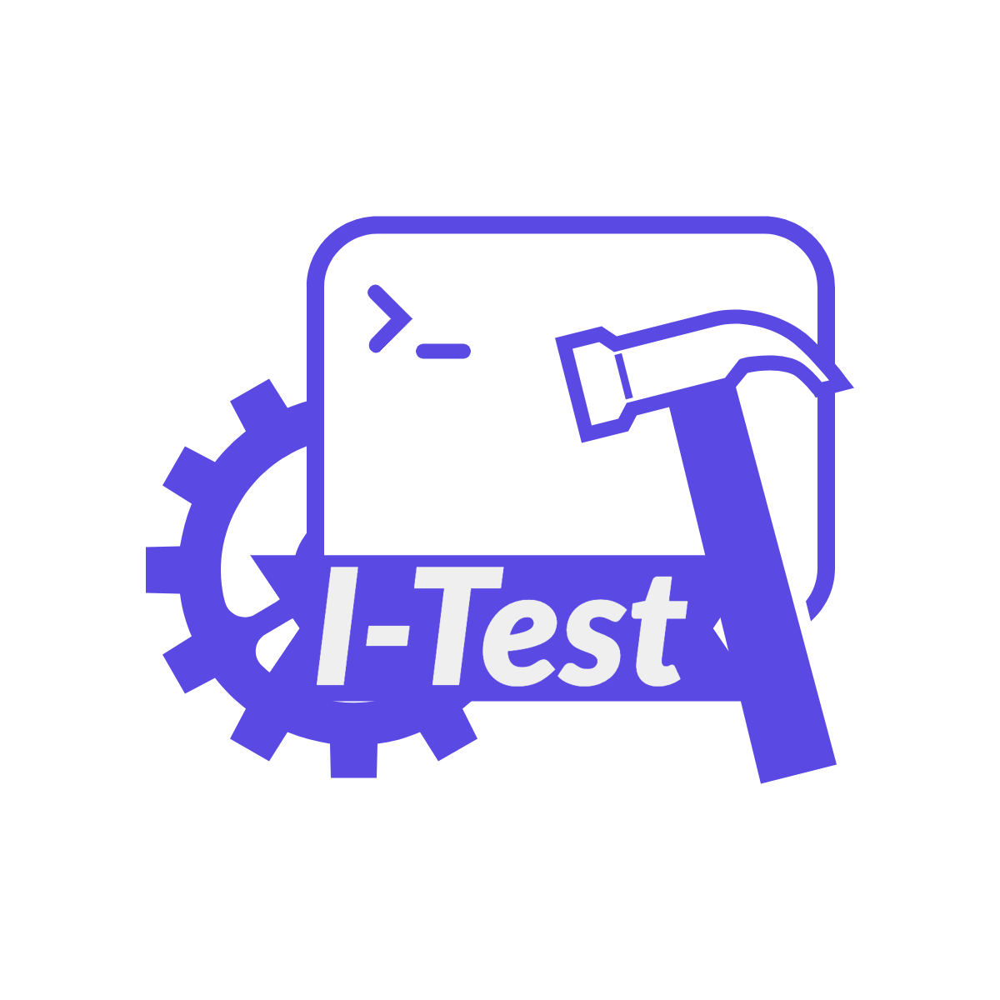

# I-Test

 

I-Test is a framework for writing inline tests in Python and Java.
## Introduction

This repo contains the code and data for producing the experiments in
[Inline Tests][paper-url].  In this work, we proposed a new type of
tests, inline tests, which reside below unit tests in the hierarchy of
test types.  Inline tests can be used to test the code on the
statement level. We implemented I-Test framework for developers to
write inline tests in Java and Python. I-Test framework has been
integrated with popular testing frameworks pytest and Junit. 

The code includes:
* I-Test framework for Python
* I-Test framework for Java
* scripts for collecting and filtering examples suitable for writing inline tests
* scripts for evaluating the performance of I-Test

The data includes:
* the 50 Python examples and 50 Java examples with our written inline tests
* results of performance evaluation (on our machine)
* the documents used in our user study
* anonymized results of our user study


**How to...**
* **install I-Test and the environment for replicating our study**: see detailed steps in [INSTALL.md](/INSTALL.md)
* **replicate our performance evaluation of I-Test**: see detailed steps in [REPLICATION.md](/REPLICATION.md)
* **replicate other parts of our paper, e.g., collecting examples and user study**: we already described the steps in the paper, and you may find the documents and intermediate files for those in this repository; see the remainder of this README for more details

## Content of this Repository

- [java](/java): code of I-Test framework for Java
- [python](/python): code of I-Test framework for Python
- [research](/research): scripts for our experiments
- data
  - [examples](/data/examples): 50 Python and 50 Java examples with our written inline tests
  - [exp](/data/exp): the configurations for running performance evluation experiments
  - [patches](/data/patches): the patches used in performance evaluation experiments, to integrated inline tests into open-source projects
  - [projects](/data/projects) and [projects-used](/data/projects-used): the list of top-100 starred open-source GitHub projects that we used to search for statements under test
  - [scripts](/data/scripts): the scripts used in performance evaluation experiments, for preparing environment and executing the unit tests or inline tests in open-source projects
- [results](/results): directory for storing the results of running performance evaluation experiments; used in the [replication guide](/REPLICATION.md)
- [results-ours](/results-ours): the results of performance evaluation on our machine
- userstudy
  - [content](/userstudy/content): the package we send to each participant in our user study
  - [response](/userstudy/response): anonymized responses collected of our user study
- [appendix.pdf](/appendix.pdf): an appendix that describes:
  - A: the details procedure of searching for statements under test in open-source projects
  - B: API of I-Test framework
  - C: analysis of user study responses


[paper-url]: /README.md

## Research

Title: [Inline Tests][paper-url]

Authors: [Yu Liu](https://sweetstreet.github.io/), [Pengyu Nie](https://pengyunie.github.io/), [Owolabi Legunsen](https://mir.cs.illinois.edu/legunsen/), [Milos Gligoric](http://users.ece.utexas.edu/~gligoric/)

If you have used I-Test in a research project, please cite the research paper in any related publication:

```bibtex
@inproceedings{LiuASE22InlineTests,
  title =        {Inline Tests},
  author =       {Yu Liu and Pengyu Nie and Owolabi Legunsen and Milos Gligoric},
  pages =        {to appear},
  booktitle =    {International Conference on Automated Software Engineering},
  year =         {2022},
}
```